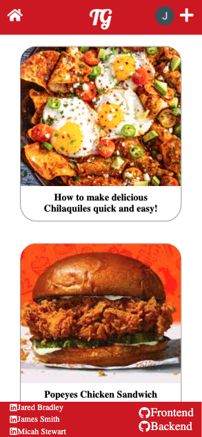
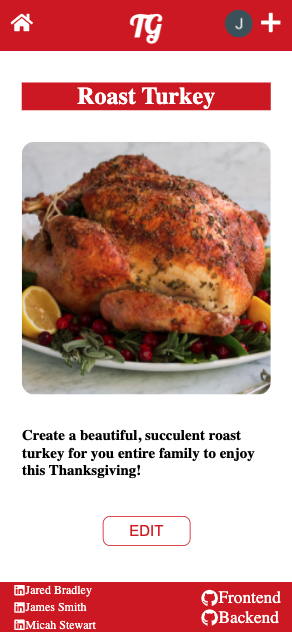
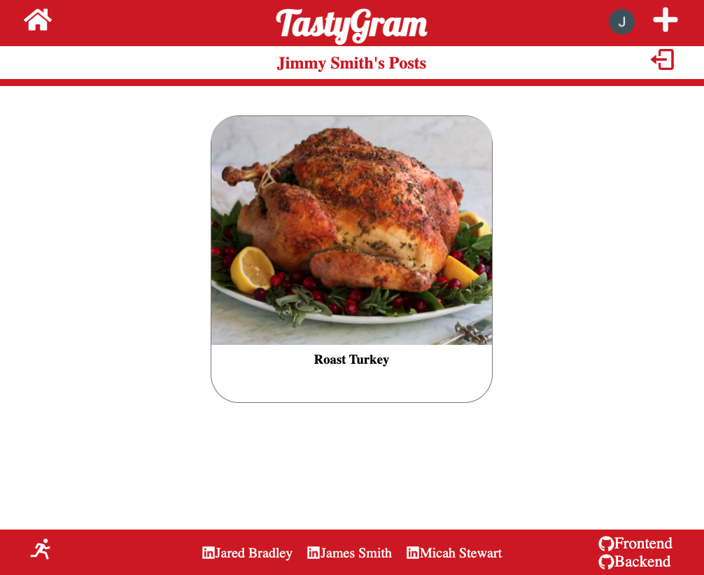
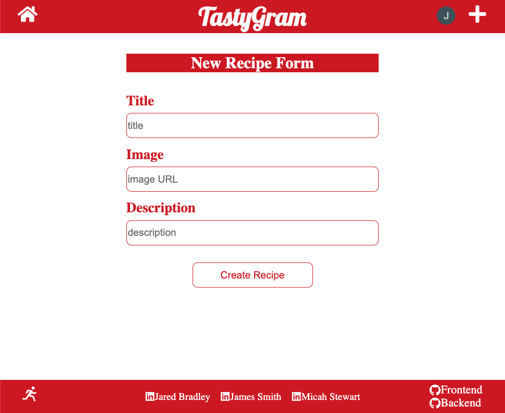

# TastyGram
### A New Take on Recipe Websites
---

### Overview
TastyGram is a scrolling focused site, similar to Instagram and other popular social media platforms, that focuses on recipes. The site was built using **React, Sass, Express, MongoDB, and Node.js**.

The app has full **CRUD** functionality for users that are logged in. A logged-in user may add new posts and edit or delete their own posts. Any visitor to the site can view posts in the main feed and in a show page, but they do not have authorization to make any changes to the posts. Authentication / authorization is achieved with **Google Firebase**. 

The frontend site consists of several page components, including main feed, create, edit / delete, dashboard, and about the developers sections. 

On the backend, the app communicates with a **MongoDB** database to perform CRUD functions on the individual documents via Post, Put, and Delete routing. 

The app was built out using a mobile-first strategy to ensure that it looks great on any device. 

---

### Technologies Used
- React
- Sass
- MongoDB
- Express
- Node.js
- Javascript
- Mongoose
- Postman

---

### Screenshots

**Landing Page - Mobile**

---

**Show Page - Mobile**

---

**Dashboard - Desktop**

---

**Create Page - Desktop**

---

### Getting Started
This entire application can be viewed without logging in, save the personalized dashboard, edit, and create buttons. These are hidden from non-authenticated users to prevent anonymous creation of posts.

**To login**, click on the person in the top right corner of the page. This will allow you to login with your Google account. 

Once you are logged in, you can **create a new post**. That new post will then appear in your dashboard. The **dashboard** is accessed by clicking on your google image, which automatically populates once you are logged in. 

Now, when you click on one of your posts, you'll see the **edit** button. You will not see this button on any posts that you did not create. By clicking the edit button, you'll be taken to the edit page where you also have an option to **delete** your post. 

**To logout**, you access your dashboard and click the logout button. This will log you out immediately and redirect you to the home page. 

To see the deployed site, please visit: https://tastygram.netlify.app/

---

### Future Improvements
In the future, we will be adding a comment chain to posts, so users can tell the poster what they enjoyed about the recipes. Additionally, we will also be creating a like button on each post so users can have a metric of the quality of their content.